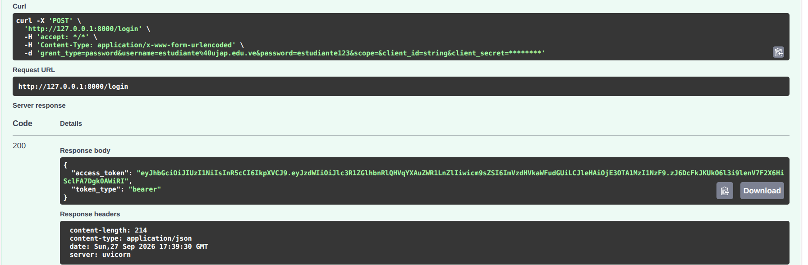
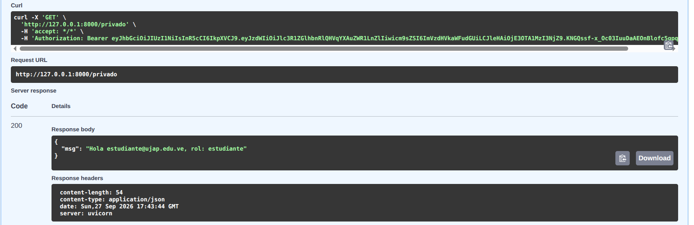
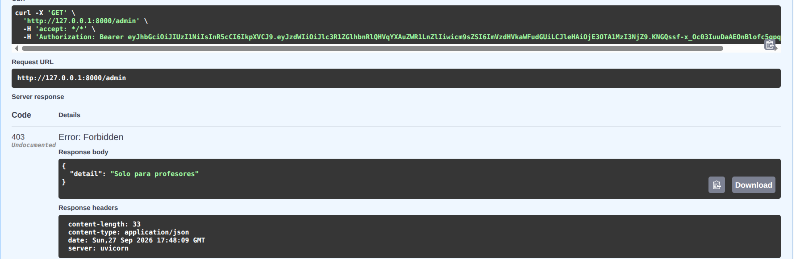

# api-jwt
LOGIN 200

PRIVADO 200

ADMIN 403

## Preguntas y respuestas

### 1. ¿Qué es JWT y cuáles son sus tres partes?

JWT significa JSON Web Token. Es un estándar abierto (RFC 7519) utilizado para transmitir información de forma segura entre partes mediante un objeto JSON. Sus tres partes son:

- **Header (Cabecera):** Contiene el tipo de token y el algoritmo de firma utilizado.
- **Payload (Carga útil):** Contiene las declaraciones o datos del usuario y la sesión (como ID, rol o fecha de expiración).
- **Signature (Firma):** Se calcula combinando el Header y el Payload codificados con una clave secreta (`SECRET_KEY`) para verificar que el token no ha sido alterado.

### 2. ¿Por qué el payload NO es seguro para guardar contraseñas?

El Payload no es seguro porque solo está codificado en Base64URL, lo que significa que no está encriptado. Cualquiera que intercepte el token puede decodificarlo fácilmente en texto plano y leer su contenido. JWT garantiza que la información no sea modificada (integridad), pero no la oculta (confidencialidad).

### 3. ¿Qué sucede si alguien modifica el payload sin conocer el SECRET_KEY?

El servidor rechazará el token automáticamente. Cuando el servidor recibe el token, vuelve a generar la firma usando el Payload modificado y su `SECRET_KEY`. Como la firma generada no coincidirá con la firma del token enviado, el servidor detectará la manipulación y denegará la petición.

### 4. Diferencia entre 401 Unauthorized y 403 Forbidden (y su uso en FastAPI)

**Diferencia principal:**

- **401 Unauthorized** se utiliza cuando no estás autenticado (el servidor no sabe quién eres).
- **403 Forbidden** se utiliza cuando estás autenticado pero no autorizado (el servidor sabe quién eres, pero no tienes permiso para acceder al recurso).

**Uso en FastAPI:**

- FastAPI usa **401 Unauthorized** cuando la petición no incluye el token Bearer, el token está expirado o la firma del JWT es inválida.
- FastAPI usa **403 Forbidden** cuando el token es válido y el usuario está identificado, pero intenta acceder a una ruta que requiere un rol o permiso superior (por ejemplo, un usuario normal intentando acceder a una ruta de administrador).